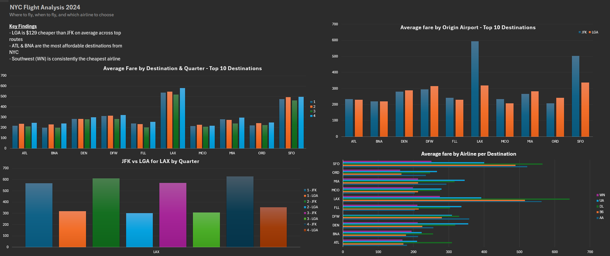

# NYC Flight Price Analysis 2024

## Overview
Analysis of domestic flight pricing from NYC-area airports (JFK, LGA, EWR) using real government data from the U.S. Bureau of Transportation Statistics.

## Key Findings
- LGA is $129 cheaper than JFK on average across the 10 most popular routes in 2024
- ATL and BNA are the most popular and affordable destinations from NYC
- Southwest (WN) is consistently the cheapest carrier across most routes
- Q3 (July-August) offers the lowest average fares despite being peak summer travel season

## Tools Used
- R (data cleaning and preparation)
- Microsoft Excel (analysis and dashboard)

## Data Source
U.S. Bureau of Transportation Statistics DB1B Market Survey, 2024 Q1-Q4 10% sample of all domestic airline tickets sold in 2024 filtered to flights originating from JFK, LGA, and EWR

## Methodology
The raw data consisted of four quarterly CSV files from the BTS DB1B Market Survey totaling ~650MB. Data was loaded and processed in R using the vroom and dplyr packages.

Cleaning steps performed in R:
- Loaded all four quarterly files and combined into a single dataframe (3.1M rows)
- Filtered to flights originating from JFK, LGA, and EWR only
- Removed rows with zero or missing fares
- Removed outlier fares below $30 and above $2,000
- Exported a cleaned 34MB CSV for analysis (970,961 rows)

Analysis performed in Excel:
- Built pivot tables analyzing average fare by destination, quarter, origin airport, and airline
- Focused analysis on top 10 most popular destinations by ticket count
- Key comparison: JFK vs LGA pricing across identical routes
- Identified Southwest as lowest-cost carrier across most routes

## Dashboard Preview
